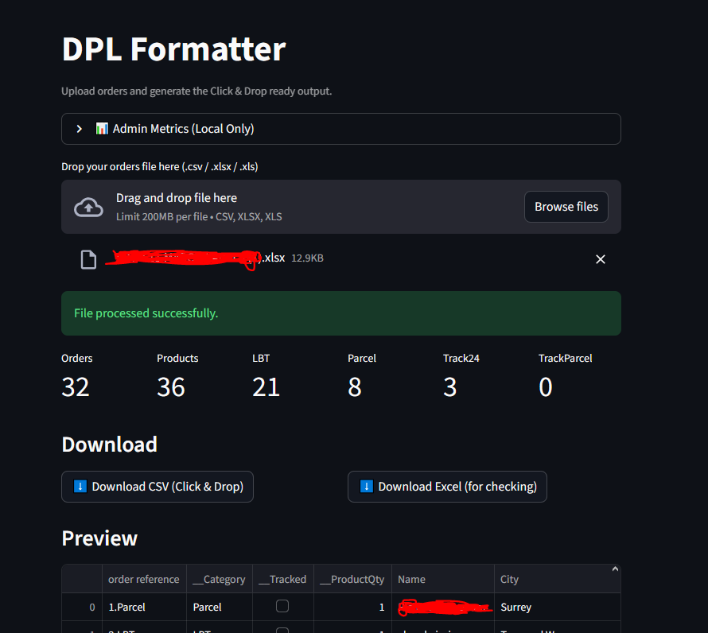

# DPL Formatter

**DPL Formatter** is a lightweight automation tool designed to convert
warehouse order exports into **Royal Mail Click & Drop compatible
shipment files**.

The system removes repetitive manual formatting work in shipping
workflows by automatically classifying shipment types and producing a
clean CSV file ready for Click & Drop import.

This project is part of a broader portfolio focused on **automation,
operational tooling, and infrastructure systems that improve reliability
in e‑commerce logistics environments**.

------------------------------------------------------------------------

# Overview

In warehouse environments handling large volumes of daily orders,
preparing shipment imports for Royal Mail Click & Drop typically
requires:

-   manual shipment classification
-   modifying order references
-   detecting tracked shipments
-   handling multi-product orders
-   ensuring formatting compatibility

DPL Formatter automates this process using a **deterministic
transformation pipeline**.

Users can:

1.  Upload a standard order export file\
2.  Automatically classify shipment type\
3.  Preview processed results\
4.  Download a Click & Drop compatible CSV

This removes repetitive operational work and ensures consistent output
formatting.

## Operational Impact

Before automation, warehouse staff had to manually prepare Royal Mail Click & Drop imports by processing orders individually. This involved reviewing each order, determining the correct shipment type, and formatting the data manually.

DPL Formatter automates this process by applying deterministic classification rules and generating a Click & Drop compatible file instantly.

The impact of this automation includes:

- transforming a manual task that could take hours into a process completed in seconds
- eliminating repetitive formatting work
- reducing human error in shipment classification
- enabling fast processing of large order batches during peak periods

This is particularly valuable during high-volume seasons such as Christmas, where order throughput increases significantly.

The warehouse processes orders from multiple drop-shippers whose stores cannot be directly connected to the Click & Drop account. DPL Formatter bridges this gap by converting exported order data into a format immediately compatible with Royal Mail's shipping system.

## Application Interface

------------------------------------------------------------------------

# Architecture

The application follows a simple but robust **three-layer processing
architecture**.

## Input Layer

Responsible for file ingestion and validation.

Supported formats:

-   CSV
-   XLSX
-   XLS

Before processing begins, the system validates that all required columns
exist in the uploaded file.

This prevents malformed files from entering the processing pipeline.

------------------------------------------------------------------------

## Processing Layer

The core processing engine applies **rule-based classification and
transformation**.

Key operations include:

-   shipment classification
-   product quantity detection
-   tracking marker detection
-   product name formatting
-   order reference transformation

All rules are deterministic, ensuring predictable outputs for identical
inputs.

------------------------------------------------------------------------

## Output Layer

The system generates files compatible with Royal Mail Click & Drop.

Outputs include:

-   Click & Drop compatible CSV
-   Excel export for verification
-   summary processing metrics

Each input row produces **exactly one output row**, ensuring a clear
transformation pipeline.

------------------------------------------------------------------------

# Shipping Classification

Orders are automatically classified into one of four shipment types.

| Type | Description |
|------|-------------|
| **LBT** | Letterbox-sized tracked shipment (48h delivery) |
| **Parcel** | Standard tracked parcel (48h delivery) |
| **Track24** | Small tracked shipment (24h delivery) |
| **TrackParcel** | Tracked parcel (24h delivery) |

Classification is determined by:

-   product type
-   size rules
-   tracking indicators

------------------------------------------------------------------------

# Multi‑Product Detection

Orders containing multiple products are detected automatically.

Example product field:

    TSHIRT-ABC-M-X1
    TSHIRT-ABC-M-X1, TSHIRT-DEF-L-X1

Product count is determined using:

    product_count = commas + 1

This ensures accurate classification of multi-item orders.

------------------------------------------------------------------------

# Tracking Detection

Tracking markers are detected from auxiliary columns within the row.

Supported tracking keywords include:

-   tracked
-   tracked 24
-   track24
-   track 24

This reflects how warehouse exports embed shipping indicators in the
dataset.

------------------------------------------------------------------------

# Click & Drop Compatible Output

The generated CSV contains the columns required by Royal Mail Click &
Drop:

-   order reference
-   Name
-   Address 1
-   Address 2
-   City
-   Postcode
-   Product Name

Order references are automatically suffixed with the shipment type.

Example:

    12345.Track24
    12346.LBT
    12347.Parcel

This allows direct import into Click & Drop without modification.

------------------------------------------------------------------------

# Operational Telemetry

The application includes an **internal event logging system** used to
monitor usage and processing activity.

Logged events include:

-   application sessions
-   file uploads
-   successful processing runs
-   download events
-   processing failures

Telemetry is stored in a **Google Sheets datastore**, providing a
lightweight operational monitoring system without requiring a database.

Metrics collected include:

-   total processing runs
-   orders processed
-   product counts
-   shipment type distribution
-   download activity

------------------------------------------------------------------------

# Admin Metrics Dashboard

A local development dashboard provides operational insights.

Metrics displayed include:

-   number of processing runs
-   total orders processed
-   total products processed
-   number of downloads
-   session count

The dashboard also displays recent event logs and charts of processing
activity.

The admin dashboard is **hidden in production deployments**.

------------------------------------------------------------------------

# Deployment

The application is deployed using **Streamlit**.

Local development:

    streamlit run app.py

Production deployment is handled through Streamlit Cloud, allowing users
to upload files directly through the web interface.

------------------------------------------------------------------------

# Repository Structure

    dpl-formatter
    ├── app.py
    ├── utils/
    │   └── metrics_logger.py
    ├── requirements.txt
    ├── README.md
    └── .gitignore

------------------------------------------------------------------------

# Design Principles

The system was designed with the same principles used in larger
automation systems:

-   deterministic processing
-   operational reliability
-   minimal user friction
-   predictable outputs

Even small operational tools can remove significant manual workload when
designed with clear rule-based logic.

------------------------------------------------------------------------

# Future Improvements

Possible future developments include:

-   direct Click & Drop API integration
-   automated order ingestion pipelines
-   expanded shipping rule configuration
-   integration with warehouse management systems

------------------------------------------------------------------------

# License

Internal operational tool provided for documentation and demonstration
purposes.
